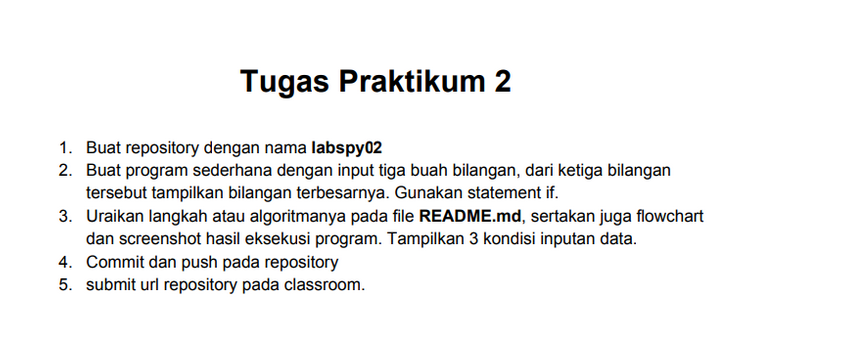

# Labspy02
#### NAMA: RISKY HARIADI <br>
#### KELAS: TI. 20. A. 1 <br>
#### NIM: 312010124 <br>
__________________________________________________________________________________
**Jadi pada pertemuan ini saya diberikan beberapa tugas oleh dosen saya yaitu Bapak. Agung Nugroho,S.Kom.,M.Kom. untuk membuat Aplikasi yang menentukan Bilangan terbesar dari tiga nilai client/user inputkan menggunakan Bahasa Pemrograman Python.
diantaranya:** <br>

## PRAKTIKUM 1 - LATIHAN 1

```
baris = 20
kolom = baris

for bar in range(baris):
    for col in range(kolom):
        tab = bar+col
        print("{0:>5} ".format(tab),end='')
    print()
```
**Mengapa demikian? Karena untuk dapat melakukan pengulangan bertingkat kamu perlu memasukan** 
```
for bar in range(baris):
    for col in range(kolom):
        tab = bar+col
        print("{0:>5} ".format(tab),end='')
    print()
```
**dan karena pada syntax tersebut kamu membutuhkan baris dan kolom maka sebelum memasukan syntax diatas kamu perlu menambahkan keterangan baris dan kolom sesuai yang kalian butuhkan seperti ini.**
```
baris = 10
kolom = baris
```
**Jika sudah memasukan semua syntax diatas dan telah di run, maka kamu akan mendapatkan tampilan seperti gambar yang ada dibawah ini**


 Pada pertemuan 7 tugas PPT ke-2 ini, saya diberikan beberapa tugas oleh dosen saya yaitu 



untuk mencari sebuah nilai maksimal dari 3 data yang sebelumnya telah diinput, dan setelah mendapat nilai 
maksimalnya, dirubah menjadi dalam 
sebuah bentuk flowchart.

## TUGAS PRAKTIKUM 2
##### MENGINPUT DATA DAN MENCARI NILAI MAX
________________________________________________________________________________________
Pertama-tama disini saya akan mencoba untuk menginput 3 data dengan menggunakan syntax berikut terlebih dahulu.
```python
a = int(input("Masukkan bilangan 1: "))
b = int(input("Masukkan bilangan 2: "))
c = int(input("Masukkan bilangan 3: "))
```
Masukan syntax tersebut dengan angka yang kalian inginkan. 


Jika sudah mendapat tampilan seperti gambar diatas, maka kalian sudah berhasil menginput ketiga data tersebut. 
<br>

Langkah selanjutnya adalah mencari tahu nilai terbesar (max) dari ketiga data tersebut. Sebelum memulainya 
kalian harus memasukan terlebih 
dahulu berapa jumlah data yang akan kalian kerjakan dari ketiga data tersebut dengan syntax <br>
```python
N=int(input("banyaknya data = "))
```
Karena disini saya diberi tugas mencari nilai max dari ketiga data maka saya akan menggunkan semua data diatas.

```python
if N>0:
    i=1
    x=int(input("data ke -"+str(i)+"="))
    max=x;total=x
    for i in range(2,N+1):
        x=int (input("data ke -"+str(i)+"="))
        total+=x
        if max<x:
            max=x

    print("bilangan terbesar =",max)
```
Selanjutnya kalian bisa langsung  memasukan syntax ini untuk melengkapi syntax diatas supaya bisa berjalan 
dengan baik seperti pada gambar 
dibawah ini.


Maka jika digabungkan, cara untuk mencari nilai max dari ketiga data yang diinputkan adalah dengan menggunakan 
syntax
```python
N=int(input("banyaknya data = "))
if N>0:
    i=1
    x=int(input("data ke -"+str(i)+"="))
    max=x;total=x
    for i in range(2,N+1):
        x=int (input("data ke -"+str(i)+"="))
        total+=x
        if max<x:
            max=x

    print("bilangan terbesar =",max)
```
Seperti inilah hasil akhirnya 


## MERUBAH DATA DIATAS MENJADI DALAM BENTUK FLOWCHART
__________________________________________________________________________________
Setelah kalian mendapatkan semua data diatas langkah selanjutnya adalah mengubahnya menjadi dalam bentuk 
flowchart seperti ini


Untuk bisa mendapatkan hasil flowchart diatas, maka kalian harus mendownload flowgorithm terlebih dahulu. 
Download lah pada web resminya yaitu :[clickHere](http://www.flowgorithm.org/download/)

Download lah yang sesuai dengan laptop kalian agar tidak terjadi kendala saat sedang mengoperasikannya.


Setelah mendapat tampilan seperti dibawah ini kalian bisa mengklik pada bagian garis hitamnya


Pada tampilan diatas kalian dapat memilih menu mana yang kalian butuhkan.

Jika kalian sudah mengerjakannya hingga akhir, maka step akhir adalah kalian hanya perlu mengecek apakah 
flowchart tersebut sudah bekera dengan
baik atau belum dengan cara sebagai berikut


Jika sudah me 'run' berkali kali dan mendapatkan jawaban sama yang sesuai itu berbarti flowchart yang kalian 
buat sudah benar dan bekerja 
dengan baik.
